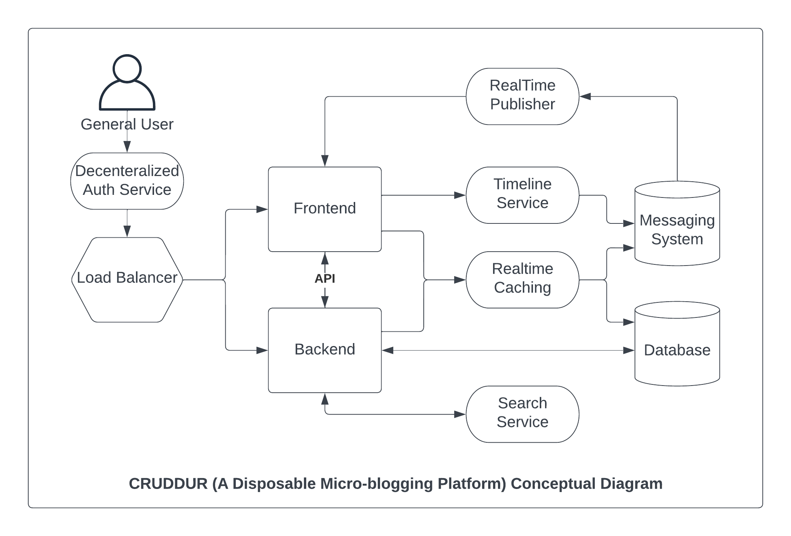
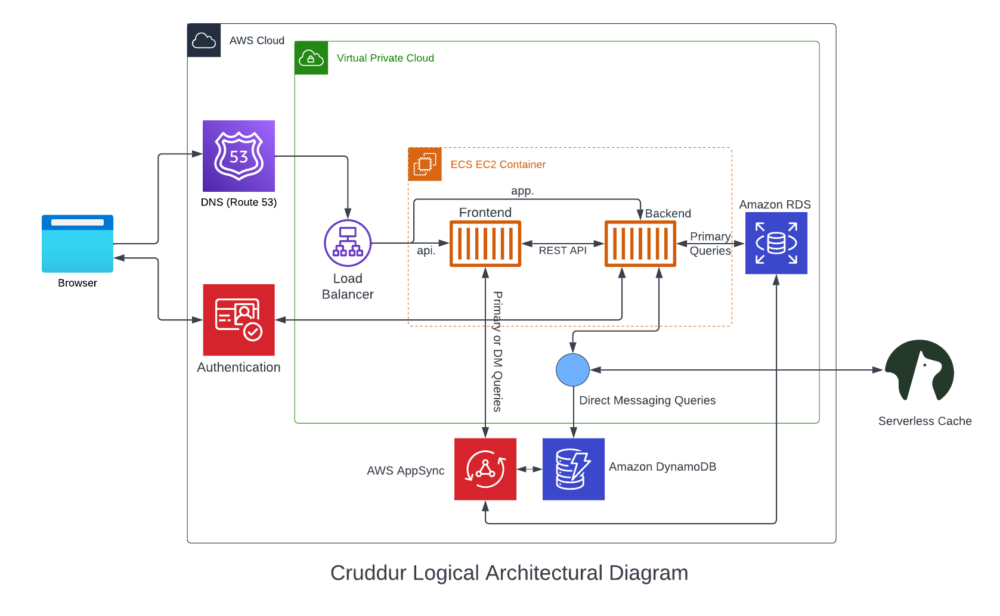
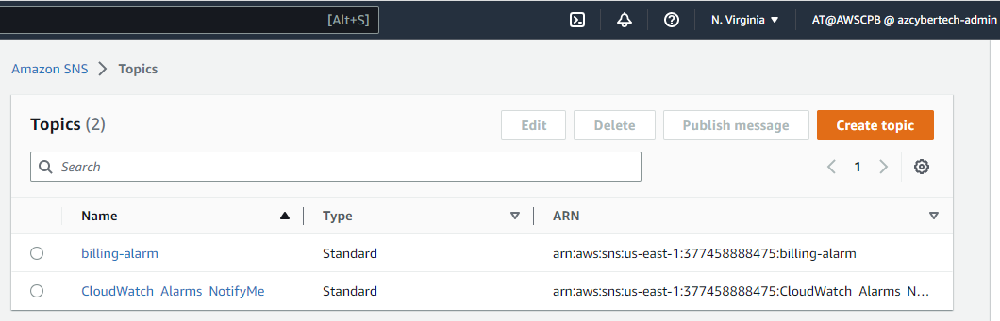
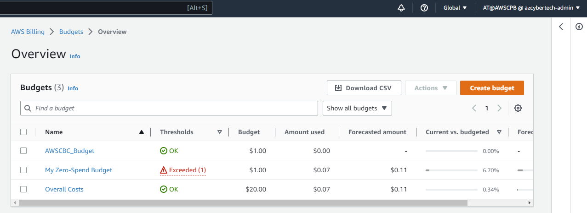

# Week 0 — Billing and Architecture

## Required Homework

### Conceptual Diagram

I created a conceptual diagram of a cruddur (micro-blogging) app.

### Logical Diagram

I created a logical diagram of the micro blogger app using lucid chart.

### Create a Billing Alarm

I created a billing alarm using CLI via Gitpod

### Create a Budget

I created a budget using CLI via Gitpod

